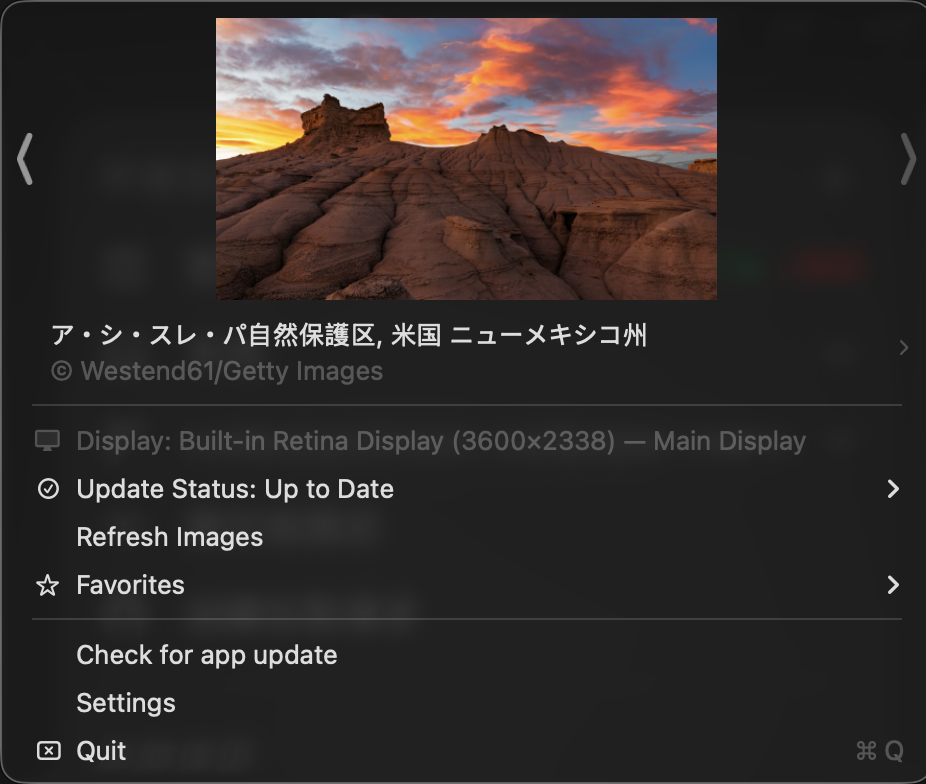
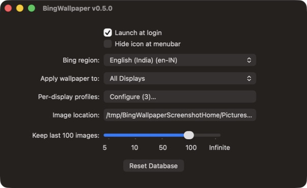
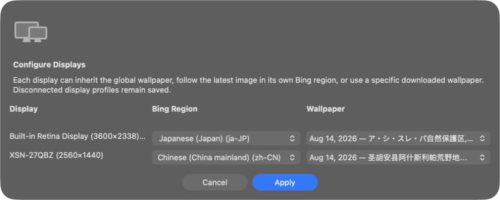

# Bing Wallpaper for Mac

  

  
  

BingWallpaper is a menubar app for MacOS which automatically downloads the newest [bing wallpaper of the day](https://www.microsoft.com/bing/bing-wallpaper)
and sets it as wallpaper for your monitors (and spaces!). All displays are
updated by default, or you can target only the main display or a custom set of
displays in the app settings.

By default, Bing selects the wallpaper market from your network location. You
can also choose any supported Bing country/region and language market in the
app settings.

Custom image locations are persisted using a macOS security-scoped bookmark.
Downloaded images are validated before they are stored, and app updates are
accepted only when the installer matches the SHA-256 checksum published with
the GitHub release.

The menu reports wallpaper update progress, the last successful update, the
next scheduled attempt, and download errors. Failed updates use exponential
backoff and can be retried immediately from the menu.

Click the wallpaper description in the menu to see its date, Bing region and
full copyright information. The same menu can open the original Bing page,
reveal the downloaded file in Finder, or save a copy elsewhere.

Wallpapers can also be pinned or added to Favorites. A pinned wallpaper is not
replaced by scheduled downloads, while favorites remain available from the
main menu and are protected from automatic retention cleanup.

Connected displays can have independent profiles. Each profile may inherit the
global settings or choose its own Bing region, and can inherit the global pin,
follow the latest image, or pin that display's current wallpaper. Profiles use
stable display identifiers and remain saved while a display is disconnected.
